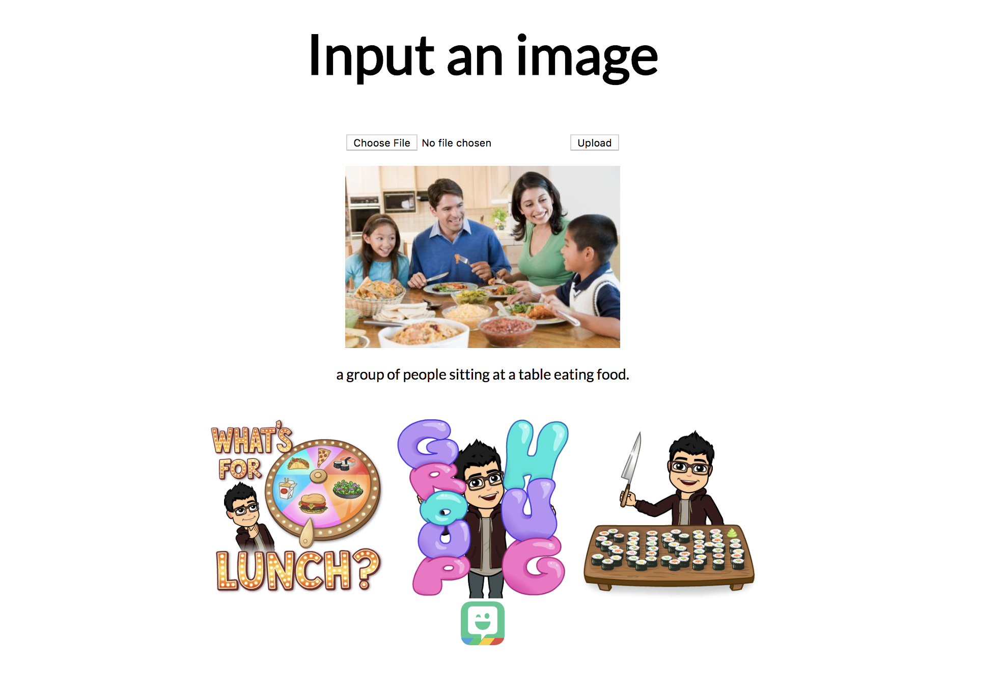

# image2bitmojisequence

### Introduction
Much of unsupervised learning is focused on finding accurate/stable embeddings in different domains. Recently, there has been interest in embeddings involving emojis: specifically, Deepmoji have investigated text to emoji embeddings. To take a novel twist on emoji embeddings, we decided to investigate image to Bitmoji embeddings. One reason why we decided to investigate image to emoji embeddings was because intuitively, images lie in the visual domain, so it should be easier to map images to emojis. We also had access to an extensive emoji collection (Bitmojis), which made it easier to convey complex emotions/concepts found in images. 

TLDR:
Overall, we aimed to build a pipeline that turned images into bitmoji sequences. To establish a baseline, we came up with a simple heuristic-based pipeline (pipeline 2 in the below specifics section) that did text to bitmoji sequences (this area has been explored — see DeepMoji), and compared the two pipelines:

## What it does
We created two machine learning pipelines: 
1) The first aimed to represent images as a sequence of bitmojis. Specifically, we take an image, generate a caption for the image, and map that caption to the space of bitmojis. We chose to generate a caption to serve as our “image embeddings” as we needed a succinct way to represent images (as bitmojis, in a way, compress information). We then map these captions to the space of bitmojis, and return a sequence of bitmojis.
2) The second pipeline aimed to represent text as a sequence of bitmojis. Specifically, given any input text, the pipeline uses pre trained word embeddings along with a heuristic (what we called the “block method”), to transform text into a sequence of bitmojis.

The demo in this repo is a Flask app that presents the first pipeline (image to bitmoji sequence), where the user is allowed to upload any image, and is returned an image caption along with a representative sequence of bitmojis.

## Specifics:
Pipeline 1:
- RNN trained on Flickr8 dataset (https://forms.illinois.edu/sec/1713398). Other datasets such as COCO or ImageNet have too many samples (we needed a quick, somewhat computationally cheap model that did an OK job at generating captions — not a state-of-the-art model). This was roughly based on the code for the paper "Show, Attend and Tell: Neural Image Caption Generation with Visual Attention" by Xu et al. (ICML2015)
- The general concept of this model consists of an encoder and decoder (as with many other representation learning models)
- Since we are mapping an image to a sequence of text (and emojis as follows), we have a CNN as our encoder (as CNN’s generally serve as good feature detectors).
- With a given hidden state, we use a LSTM with attention as our RNN to roll out a sequence from this encoded hidden state.
- These vectors can be converted to words (by looking at the initial dictionary of words the model builds) and emojis through embeddings (such as the one presented in Pipeline 2).

Pipeline 2: (not demoed in this repo, but for reference)
- We are given as input a sequence of text representing a sentence
- We can convert this text to a tree using a variety of learned grammar representations
- We chose to use Stanford’s NLTK since with the time bounds of a Hackathon training our own was not feasible
- From this, we can recurse on the generated sentence tree, splitting on verb phrases and noun phrases. Bitmojis are generally representative of an entity performing an action or in a state of being, so this made sense to maximize the ability of our embedding to capture an Bitmoji space
- We can then match these sequences of text with ground truth text labels of Bitmojis, which allow us to choose the best Bitmoji that matches our selected sequence of text
- We can match by taking minimum distances in another embedding space of strings; again for brevity we chose to use Word2Vec and weighted sums of strings within a phase

